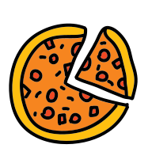

<p align="center">
  
</p>
<h1 align="center">Welcome to Typed Pizza</h1>

Add your favourite pizza to your cart. Refresh the page all is there! This app was built with Webpack, React, TypeScript, Css Modules and other supporting packages.

### ✨ [Demo](https://condescending-knuth-40d72d.netlify.app/)

## Install

```sh
npm install
```

## Usage

```sh
npm run build
npm start
```

## Author

👤 **Yamac Ozdil**

* Website: [yamacozdil.com](https://yamacozdil.com)
* Github: [@yozdil](https://github.com/yozdil)
* LinkedIn: [@yamac-ozdil](https://linkedin.com/in/yamac-ozdil)